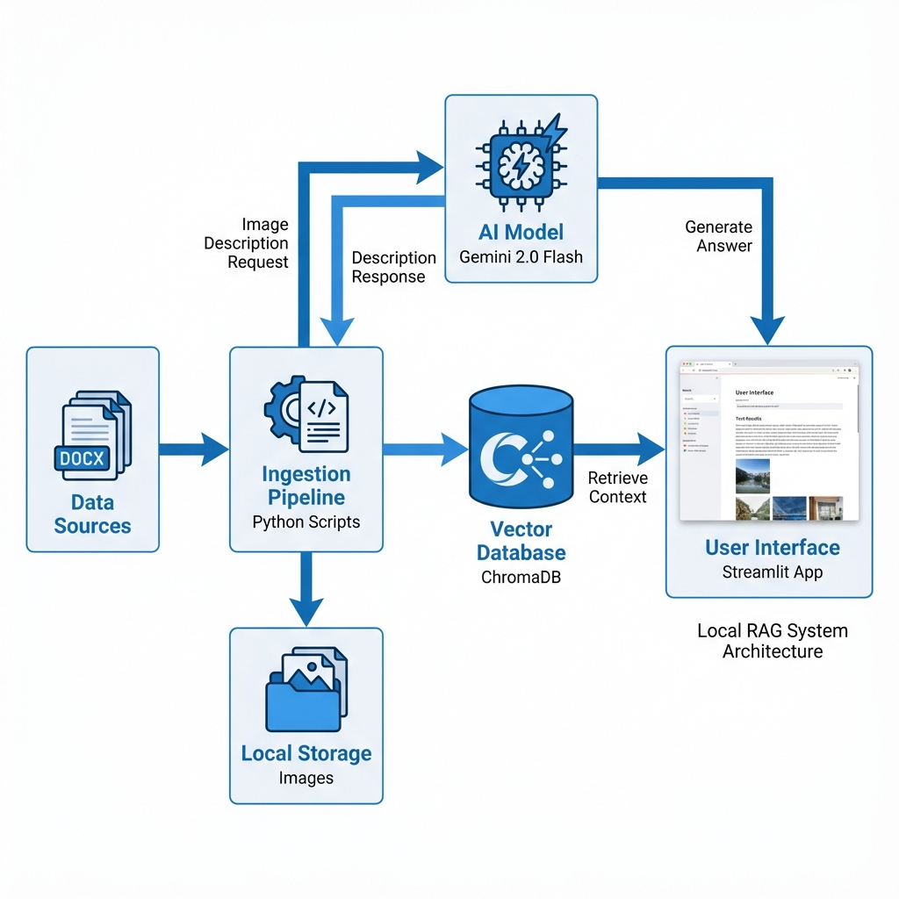

# UZIO Local RAG Assistant 🤖

A powerful, local Retrieval-Augmented Generation (RAG) agent designed to answer questions about UZIO's Scheduling and Time Tracking modules. This application processes complex DOCX documentation, including charts and screenshots, to provide accurate, context-aware answers.

## 🏗️ System Architecture



## 🧩 Key Components

### 1. Data Ingestion Layer
- **Source**: UZIO Word Documents (`.docx`).
- **Extraction**: `extractor.py` pulls text and saves images locally.
- **Processing**: `processor.py` uses **Gemini 2.0 Flash** to generate detailed textual descriptions for charts and screenshots, creating a purely text-based search index that preserves visual information.

### 2. Efficiency Layer
- **Vector Database**: **ChromaDB** stores text embeddings locally for fast retrieval.
- **Embeddings**: Uses Google's `models/text-embedding-004`.
- **Pre-computation**: Heavy lifting (image analysis) is done *once* during ingestion, not at runtime, ensuring fast query responses.

### 3. Intelligence Layer
- **Brain**: **Gemini 2.0 Flash** serves as the reasoning engine.
- **Context**: The model receives the top 5 most relevant text chunks (or image descriptions) to formulate its answer.

### 4. User Interface
- **Streamlit**: A clean, professional web interface for chatting with the assistant.
- **Features**: 
    - Real-time responses.
    - View source context (transparency).
    - Image display (shows the actual screenshot used for the answer).
    - Session management.

## 🚀 Getting Started

1.  **Install Dependencies**:
    ```bash
    pip install streamlit llama-index llama-index-vector-stores-chroma llama-index-embeddings-gemini python-dotenv
    ```
2.  **Configure API Key**:
    - Create a `.env` file and add: `GOOGLE_API_KEY=your_key_here`
3.  **Run the App**:
    ```bash
    streamlit run app.py
    ```

---
*Powered by Google Gemini 2.0 & LlamaIndex*
